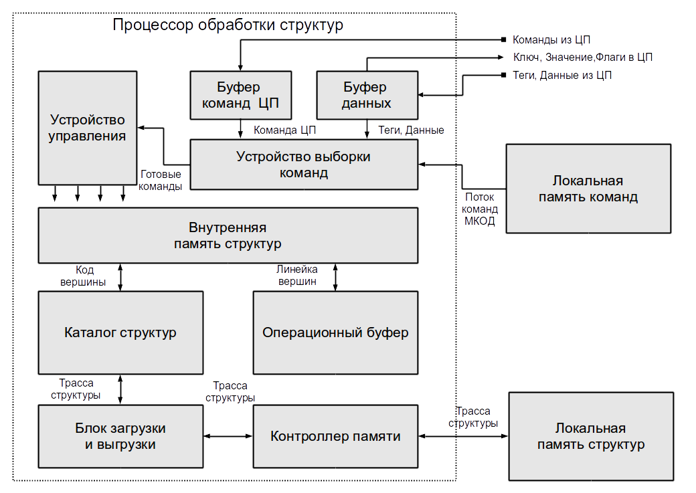
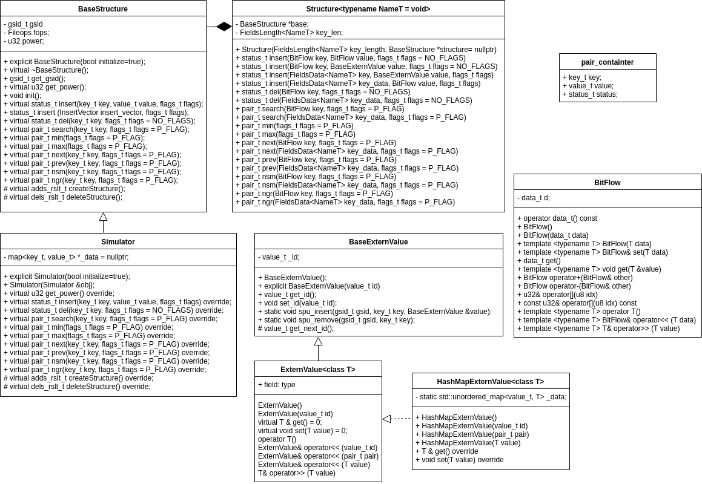

ПРОГРАММНЫЙ ИНТЕРФЕЙС ПРОЦЕССОРА С НАБОРОМ КОМАНД ДИСКРЕТНОЙ МАТЕМАТИКИ
=======================================================================


## Материалы по установке SDK Baikal находятся [тут](https://www.baikalelectronics.ru/products/T1/)
## Инструкция по подключению:
1. Собрать [образы ядра драйвера leonhard](https://www.baikalelectronics.ru/upload/Stuff/Baikal_Electronics-SDK_seminar-221118%20%281%29.pdf).
2. Запустить скрипт $BAIKAL_SDK_PATH/usr/scripts/build-boot-img.sh bfkx -a
3. Скачать [API Level0](https://bmstu.codes/twobrowin/spu-api).
4. Изменить в скрипте cp_images_to_srv.sh путь к Baikal SDK и имя пользователя на сервере. Запустить скрипт cp_images_to_srv.sh
5. Подключиться к Baikal с сервера 195.19.32.95 (доступ по ssh доступен всем).
6. На сервере понадобятся две консоли: /dev/ttyACM0 (управляющая) и /dev/ttyUSB0 (linux shell).
7. Подключиться к управляющей консоли: minicom -D /dev/ttyACM0
8. Запустить Baikal систему: power on
9. В консоли /dev/ttyUSB0 выбрать пункт 7 меню (загрузка по tftp). В итоге ваш кастомный образ из папки /tftp/ будет загружен в систему.
10. После загрузки Linux копировать выданные скриптом cp_images_to_srv.sh в консоль Baikal shell (minicom -D /dev/ttyUSB0). Запустить команды. В итогу в вашей ~/ директории будут записаны драйвер leonhard, и текстовый код. Далее можно начать тестирование вашего приложения.


РЕФЕРАТ
=======

МИКРОПРОЦЕССОРНЫЕ СИСТЕМЫ, 
ПРОЦЕССОР ОБРАБОТКИ СТРУКТУР, 
ПРОЦЕССОР С НАБОРОМ КОМАНД ДИСКРЕТНОЙ МАТЕМАТИКИ, 
ПРОГРАММНЫЙ ИНТЕРФЕЙС, 
СИСТЕМНОЕ ПРОГРАММИРОВАНИЕ.

Настоящая работа посвящена анализу и исследованию программной модели процессора 
с набором команд дискретной математики (процессора обработки
структур, далее СП) и разработке программного интерфейса к СП. 
Программный интерфейс предназначен для включения в
разрабатываемое программное обеспечение с использованием
вычислительной мощности СП.

Программный интерфейс состоит из драйвера СП для ОС GNU/Linux и
библиотеки СП. Драйвер предоставляет интерфейс передачи команд
процессора обработки структур на основе символьного файла посредством
системной шины PCI. Библиотека СП обеспечивает упрощение передачи
управляющих команд драйверу и основывается на объектном подходе к
рассмотрению структур СП.

Отличительной особенностью библиотеки СП является наличие
системы классов, обеспечивающей возможность разметки данных на
именованные поля. Данные рассматриваются как набор разрядов и могут
представлять как ключ, так и значение структуры СП.


СОДЕРЖАНИЕ
==========


ВВЕДЕНИЕ
========

Современные вычислительные машины обладают не только
достоинствами, вытекающими из принципов унификации и универсальности,
но и рядом недостатков. В качестве основного обрабатывающего блока ЭВМ
выступает арифметико-логическое устройство [1]. Вместе с тем, при решении
практических задач используется существенно большее количество
математических операций, включая операции над множествами в дискретной
математике.

В МГТУ им. Н.Э. Баумана проведен полный цикл создания
принципиально новой универсальной вычислительной системы, начиная от
создания принципов и моделей и заканчивая созданием опытного образца,
проведения тестов и испытаний [2]. Разработано принципиально новое
вычислительное устройство: Процессор с набором команд дискретной
математики (Процессор обработки структур, далее СП), реализующее набор
команд дискретной математики высокого уровня над множествами и
структурами данных. Новая архитектура позволяет более эффективно
решать задачи дискретной оптимизации, основанные на моделях множеств,
графов, и отношений.

Включение вычислительных ресурсов СП в разрабатываемое ПО
выполняется посредством программного интерфейса (далее ПИ). Для
программиста ПИ представляет собой библиотеку СП, обеспечивающую
передачу команд и операндов СП, получение результатов выполнения
операций.

Существующая версия ПИ СП требует знаний системного
программирования СП для использования. Такая версия ПИ не позволяет
вовлекать новых разработчиков, что приводит к проблеме развития СП.

Алгоритмы, разработанные специально для СП, опираются на ширину
ключа для поиска записей в памяти СП и определяют составные поля
представления ключа. Существующая версия ПИ предоставляет функции
разбиения данных на поля комплексными манипуляциями усвоения сдвигов в
поразрядном представлении данных.

К разрабатываемой версии ПИ предъявляются следующие основные
требования:
1. рассмотрение структур СП как объектов;
2. выполнение разбиения данных на поля в объектной модели;
3. выработка метода расширения количества хранимых структур СП;
4. выработка метода потоковой обработки команд СП и выполнение
системной поддержки (уровня драйвера СП) ПИ на основаниях
ассемблера СП.


# 1 Основные характеристики микроархитектуры СП

Процессор с набором команд дискретной математики (процессор
обработки структур, СП) представляет собой вычислительный модуль, работа
которого основана на хранении данных вида ключ-значения и их
объединении в структуры [11]. Структуры СП представляют собой наборы
данных ключ-значение. Процессор способен выполнять действия над
структурами, соответствующие основным операциям дискретной математики
над множествами. Среди этих операций: добавление, удаление, поиск (в том
числе поиск наиболее похожего), а также операции над несколькими
структурами (пересечение, сложение, вычитание).

Структуры данных с формальной точки зрения представляет собой совокупность
двух сущностей: информационную составляющую о значениях полей данных и структурную 
составляющую, учитывающую отношения данных. Такая двойственность
позволяет разделить процесс обработки структур данных на два потока вычислений:
во-первых, поток обработки структурной составляющей и, во-вторых, поток обработки
информационной части. В связи с этим в вычислительной системе может быть два
параллельно работающих микропроцессора: это специальный микропроцессор, который
обрабатывает реляционную (структурную) часть структур данных, в то время как 
универсальный CPU выполняет вычисления над информационной составляющей структур.


Рисунок 1 ― Архитектура вычислительной системы с несколькими потоками команд и 
одним потоком данных


На рисунке 2 представлена микроархитектура реализации СП под
названием Leonhard. В [2] приведено исчерпывающее описание блоков
микроархитектуры СП, даны принципы работы. Настоящая работа
рассматривает эту архитектуру как «чёрный ящик».




Рисунок 2 ― Микроархитектура микропроцессора Leonhard


Для ускорения поиска и обработки всего набора команд микропроцессор Leonhard
x64 использует внутренне представление множеств в виде B+дерева, для которого
возможна параллельная обработка нескольких вершин дерева как на промежуточных
уровнях, используемых для поиска, так и на нижнем уровне, хранящем непосредственно
ключи и значения. В связи с этим любая операция над структурой начинается с поиска
информации в B+дереве, а заканчивается обработкой так называемых листьев дерева
(вершин нижнего уровня).


# 2 Набор команд дискретном математики

Микропроцессор Leonhard x64 хранит информацию о множествах в виде неперекрывающихся 
B+ деревьев. Последняя версия набора команд Leonhard x64 была расширена
двумя новыми инструкциями (NSM и NGR) для обеспечения требований некоторых
алгоритмов. Каждая инструкция набора включает до трех операндов (таблица 1.1):

Таблица 1 - Формат данных Leonhard x64

| Структура | Ключ    | Значение |
| --------- | ------- | -------- |
| 3 бита    | 64 бита | 64 бита  |


Набор команд состоит из 20 высокоуровневых кодов операций, перечисленных ниже.
- **Search (SRCH)** выполняет поиск значения, связанного с ключом.
- **Insert (INS)** вставляет пару ключ-значение в структуру. SPU обновляет значение,
если указанный ключ уже находится в структуре.
- **Операция Delete (DEL)** выполняет поиск указанного ключа и удаляет его из
структуры данных.
- **Neighbors (NSM, NGR)** выполняют поиск соседнего ключа, который меньше (или
больше) заданного и возвращает его значение. Операции могут быть использованы
для эвристических вычислений, где интерполяция данных используется вместо
точных вычислений (например, кластеризация или агрегация).
- **Maximum /minimum (MAX, MIN)** ищут первый или последний ключи в структуре данных.
- **Операция Cardinality (CNT)** определяет количество ключей, хранящихся в структуре.
- **Команды AND, OR, NOT** выполняют объединения, пересечения и дополнения в
двух структурах данных.
- **Срезы (LS, GR, LSEQ, GREQ)** извлекают подмножество одной структуры данных в другую.
- **Переход к следующему или предыдущему (NEXT, PREV)** находят соседний
(следующий или предыдущий) ключ в структуре данных относительно переданного
ключа. В связи с тем, что исходный ключ должен обязательно присутствовать в
структуре данных, операции NEXT/PREV отличаются от NSM/NGR.
- **Удаление структуры (DELS)** очищает все ресурсы, используемые заданной структурой.
- **Команда Squeeze (SQ)** дефрагментирует блоки памяти DSM, используемые структурой.
- **Команда Jump (JT)** указывает SPU код ветвления, который должен быть
синхронизирован с CPU (команда доступна только в режиме MISD).

Микропроцессор реализован на базе микросхемы ПЛИС XC6VLX240T-1FFG1156,
входящей в состав отладочной платы ML605

Таблица 2 - Параметры Leonhard x64

| Параметр                                                       | Значение    |
| -------------------------------------------------------------- | ----------- |
| Максимальный размер команды в локальной памяти команд СП (LCM) | 144 бит     |
| Максимальный размер команды из ЦП                              | 160 бит     |
| Максимальный размер результата из СП в ЦП                      | 64 бит      |
| Количество разрядов поля ключа                                 | 64 бит      |
| Количество разрядов поля значения                              | 64 бит      |
| Расположение байт в памяти                                     | Младший байт по младшему адресу |
| Размер внешней памяти структур                                 | 4 ГБайта    |
| Максимальное количество ключей в структуре                     | 100 663 296 |
| Кратность вершины B+ дерева                                    | 8           |
| Количество ключей на нижнем уровне дерева                      | 6           |
| Максимальное количество хранимых структур                      | 7           |


# 3 Описание программного интрфейса

Ниже на рисунке 3 представлена диаграмма классов разработанного програмного интерфейся:



Рисунок 3 ― Диаграмма классов программного интерфейса

Далее приводится описание взаимодействия с данным программным интерфейсом.


## 3.1 Описание структур СП программного интерфеса

Класс `BaseStructure` является базовым классом структуры и непосредственно взаимодействует с СП. 
Методы `insert`, `del`, `search`, `min`, `max`, `next`, `prev`, `nsm`, `ngr`, `get_power` 
реализуют соответствующие команды процессора с набором команд дискретной матиматики. 
Также имются protected методы `createStructure` и `deleteStructure`, которые соответственно
вызываются для создании и удалени структуры в СП.
Все выше перечисленные методы являются виртуальными для легкой подмены 
при использовании симулятора процессора. Поле `gsid` содержит глобальный идентификатор 
структуры СП, к которой относисится текущий экземпляр `BaseStructure`.

Класс структура `Structure` является шаблоном и реализует интерфейс взаимодействия 
со структурой СП. Описание структуры несколько разнится в зависимости от 
заданного типа названий в разбиении полей ключа структуры. 
Переданный в шаблон тип определяет тип идентификаторов аргументов ключа.
Этот класс имеет конструкторы для создания новой структуры и для создания структуры 
как результат операции над другими структурами. 

Класс `BitFlow` предназначен для преобразования любой структуры размером не более 8 байт
к типу данных `data_t` и обратно. Реализация этого класса
рассматривает структуры как набор бит, которые следует расположить числах,
составляющих `data_t`. Например, число длиной 64 разряда в случае 64
разрядного исполнения СП будет размещено старшей частью в элементе 1
массива данных `data_t`, а младшей — в элементе 0.


Ниже в листинге 1 показан пример создания 
структуры СП и вставки пары ключ-значение в неё.

Листинг 1 - Пример создания структуры, вставки и поиска пары ключ-значение
```objectivec
#include "libspu/structure.hpp"

// Создание структуры struct1 с аргументами ключа: "one", "two", "three" и их размерами в битах
Structure<string> struct1({
    { "one",    5 },
    { "two",    7 },
    { "three", 10 }
});

// Вставка пары ключ-значение, где
// ключ: {"one": 3, "two": 3, "three": 3}
// значение: 1.123 
struct1.insert({
                  { "one",    3 },
                  { "two",    3 },
                  { "three",  3 }
              }, 1.123);

// Получить значение для ключа {"one": 3, "two": 3, "three": 3}
pair_t pair = struct1.search({
                         { "one",    3 },
                         { "two",    3 },
                         { "three",  3 }
                     });
if (pair.status == OK) {
  // value является парой двух 32-рязрядных чисел
  unsigned int val0 = pair.value[0];
  unsigned int val1 = pair.value[1];
  cout << "Found: " << val0 << " " << val1 << endl;
  cout << "Full pair is " << to_string(pair) << endl;
  // Также можно обратно получить исходное значение
  double dval = (BitFlow&) pair.value;
  cout << "Found double: " << dval << endl;
}
```

Листинг 2 - Пример демонстрации работы со структурой с шаблонным типом `void`
```objectivec
struct Point2D {float x; float y};
Point2D point = {3.14, 2.7};

// Создание структуры struct2 без определения агрументов ключа
Structure<> struct2;

// Можно вставлять любые структуры данных, размер которых меньше 8 байт
struct2.insert(123, 120);
struct2.insert("abc", 10.123);
struct2.insert(5.321, 50);
struct2.insert(8, point);

// И соответсвенно даставать
pair = struct2.search(123);
int val123 = (BitFlow&) pair.value;
pair = struct2.search("abc");
double valabc = (BitFlow&) pair.value;
pair = struct2.search(5.321);
int val5321 = (BitFlow&) pair.value;
pair = struct2.search(8);
Point2D valpoint = (BitFlow&) pair.value;
```

Листинг 3 - Пример демонстрации работы с методами `min`, `max`, `next`, `prev`, `nsm`, `ngr`
```objectivec
Structure<> struct3;
struct3.insert(2, 120);
struct3.insert(1, 10);
struct3.insert(5, 50);
struct3.insert(4, 40);

pair = struct3.search(2);
long long val2 = (BitFlow&) pair.value;
cout << "Value for struct 2: " << val2 << endl;

/// Получить пару ключ-значение с минимальным ключом в структуре
pair_t min = struct3.min();     //=> 1: 10
/// Получить пару ключ-значение с максимальным ключом в структуре
pair_t max = struct3.max();     //=> 5: 50

/// Получить следующую пару ключ-значение
pair_t next = struct3.next(1);  //=> 2: 120
/// Получить предыдущую пару ключ-значение
pair_t prev = struct3.prev(5);  //=> 4: 40

/// Получить ближайшую пару ключ-значение у которой ключ меньше заданного
pair_t nsm = struct3.nsm(3);    //=> 2: 120
/// Получить ближайшую пару ключ-значение у которой ключ больше заданного
pair_t ngr = struct3.ngr(3);    //=> 4: 40
```


## 3.2 Хранение крупных структур данных

Для храниния крупных структур, размер которых больше 8 байт, 
был определен интерфейс `BaseExternValue`, а также дочерний шаблонный интерфейс 
`ExternValue<class T>`, определяющий тип хранимого значения.
У `BaseExternValue` имеется поле `_id`, которое является идентификатором для текущей структуры.
Данный идентификатор будет записан как значение в структуру СП. 
Когда потребуется достать данные по этому идентификатору будет найдена,
соотвествующая ему, крупная структура данных.

Для определения класса внешного хранилища значений необходимо уноследоваться от 
интерфейса `ExternValue<class T>` и реализовать методы `T & get()`, `void set(T value)`,
для соответствующего получения и записи данных. Ниже в листинге 4
приводится определение класса `HashMapExternValue<class T>`, который реализует хранение 
крупных структур внутри хеш-таблицы в опреративной памяти.

Листинг 4 - Определение класса `HashMapExternValue<class T>`
```objectivec
template <class T>
class HashMapExternValue : public ExternValue<T> {
    static std::unordered_map<value_t, T> _data;
    
    public:
    HashMapExternValue() : ExternValue<T>() {}
    /// Данный констуктор инициализирует id. Используется при получении данных из SPU.
    HashMapExternValue(value_t id) : ExternValue<T>(id) {}
    /// Данный констуктор инициализирует id. Используется при получении данных из SPU.
    HashMapExternValue(pair_t pair) : ExternValue<T>(pair.value) {}
    /// Данный констуктор должен записать данные.
    HashMapExternValue(T value) : ExternValue<T>() { set(value); }
    T & get() override { return _data[BaseExternValue::get_id()]; }
    void set(T value) override { _data[BaseExternValue::get_id()] = value; }
};

template <class T>
std::unordered_map<value_t, T> HashMapExternValue<T>::_data = std::map<value_t, T>();
```

Листинг 5 - Пример работы с крупными структурами данных
```objectivec
/// C помощью HashMapExternValue можно сохранять структуры любого размера.
string string1 = "This string stored at hash map. In SPU stored id for a string";
BaseExternValue extern_val = HashMapExternValue<string>(string1);
struct2.insert(1, extern_val);

pair = struct2.search(1);
string res_str = (HashMapExternValue<string>) pair.value;
cout << res_str << endl;


struct Point {double x; double y; double z};
Point p = {1.5, 2.3, 3.7};
HashMapExternValue<Point> point_ext;
/// Операторы << и >> делают тоже, что и методы set и get
point_ext << p;
struct2.insert(2, point_ext);

pair = struct2.search(2);
if (pair.status == OK) {
    point_ext << pair;
    Point p_res;
    point_ext >> p;
    cout << "Point struct X=" << p.x << " Y=" << p.y << " Z=" << p.z << endl;
}
```


## 3.3 Использование симулятора СП

Был реализован симулятор СП, для обеспечения ускорения при разработки 
программного обеспечения. Благодаря симулятуру можно тестировать программный продукт 
при отсутствии процессора с набором команд дискретной математики. 

Для включения симулятора СП достаточно в любом месте кода сделать объявление `SPU_SIMULATOR`.

```objectivec
/// Объявление SPU_SIMULATOR определяет использовать ли симулятор SPU по умолчанию
#define SPU_SIMULATOR

/// Теперь все структуры по умолчанию используют в качестве базовой структуры Simulator
Structure<> struct3;
struct3.insert(2, 120);
pair = struct3.search(2);
```

Также в конструктор структуры можно передать симулятор:

```objectivec
BaseStructure *baseStructure = new Simulator;
Structure<string> struct1({
                         { "one",    5 },
                         { "two",    7 },
                         { "three", 10 }
                     }, baseStructure);
```

Симулятор был реализован на базе отсортированный ассоциативный контейнера `std::map`, 
который имеет схожие асимптотики: добавление, удаление, обращение к элементам
происходит за `O(log n)`, где `n` — размер контейнера.


ЗАКЛЮЧЕНИЕ
==========

В результате выполнения настоящей работы было проведен анализ и исследование 
программной модели процессора с набором команд дискретной математики получен программный
интерфейс СП, используемый для включения в разрабатываемое программное обеспечение
для получения доступа к вычислительным ресурсам СП.

Программный интерфейс состоит из библиотеки СП, обеспечивающей
поддержку объектов-структур СП, разметки данных в поля, и драйвера СП,
обеспечивающего системную поддержку СП. Использование ПИ в программном 
обеспечении возможно без задействования библиотеки СП.

Основными особенностями настоящей версии ПИ являются:
1) рассмотрение структур СП как объектов;
2) выполнение разбиения данных на поля в объектной модели;
3) разработка метода расширения количества хранимых структур СП;
4) разработка метода потоковой обработки команд СП и выполнение
системной поддержки (уровня драйвера СП) ПИ на основаниях ассемблера СП.


СПИСОК ИСПОЛЬЗОВАННЫХ ИСТОЧНИКОВ
================================

1. Таненбаум Э.С., Остин Т. Архитектура компьютера. 6-е изд. - СПб.:Питер, 2015. — 816 с.
2. Попов А.Ю. Электронная вычислительная машина с многими
потоками команд и одним потоком данных: пат. 71016 Российская
Федерация. 2008. Бюл. No 5. — 1 с.
3. Попов А.Ю. Электронная вычислительная машина с аппаратной
поддержкой операций над структурами данных // Аэрокосмические
технологии, 2009. Т. 1: Тр. Второй Междунар. научно-техн. конф.,
посвященной 95-летию со дня рождения академика В.Н. Челомея. ОАО
«ВПК НПО машиностроения», МГТУ им. Н.Э. Баумана, Москва, 2012, с. 296-301.
4. Попов А.Ю. Реализация электронной вычислительной машины с
аппаратной поддержкой операций над структурами данных // Вестник
МГТУ им. Н.Э.Баумана. Сер. Приборостроение. 2011. Спец. Вып.
Информационные технологии и компьютерные системы, c. 83-87.
5. Попов А.Ю. Применение вычислительных систем с многими
потоками команд и одним потоком данных для решения задач
оптимизации // Вестник МГТУ им. Н.Э.Баумана. Сер.
Приборостроение. 2012. Спец. вып. Компьютерные системы и
технологии, с. 146-154.
6. Попов А.Ю. Исследование производительности процессора
обработки структур в системе с многими потоками команд и одним
потоком данных // Инженерный журнал: наука и инновации, 2013, вып.
URL: http://engjournal.ru/catalog/it/hidden/1048.html
(дата обращения 01.10.2015).
7. Подольский В.Э., Попов А.Ю. Методика декомпозиции
информационного графа программы для организации параллельной
обработки данных на ЭВМ МКОД // Вестник МГТУ им. Н.Э. Баумана.
Сер. Приборостроение. 2016. No 1. с. 112-128.
8. Popov, A. An Introduction to the MISD Technology / A. Popov //
HICSS50. Proceedings of the 50th Hawaii International Conference on
System Sciences, 2017. P. 1003-1012.
9. Краткое описание процессора Байкал-Т1. Ред. Михаил Бессонов —
URL: https://www.baikalelectronics.ru/upload/iblock/be0/bt_datasheet_rus_releasу
_v2.3_11.10.2018.pdf (дата обращения 20.05.2019).
10. Учебное пособие по программированию микропроцессора «Байкал-Т1» —
URL: https://www.baikalelectronics.ru/upload/iblock/958/SDK_4.15_Quick_User_Guide_Rus.pdf 
(дата обращения 20.05.2019).
11. Общий справочник языка C++ [электронный ресурс] — URL: 
https://ru.cppreference.com/w/ (дата обращения 20.05.2019).