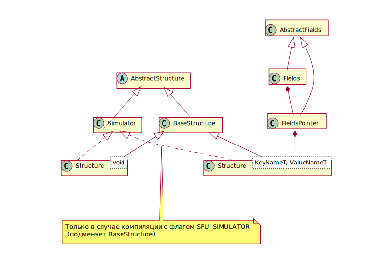

# Программный интерфейс процессора обработки структур (СП) Leonhard API0
===

Этот проект содержит исходные тексты и указания к сборке программ с использованием C++ библиотеки `libspu`.

Основное средство сборки - `cmake`. Чтобы собрать собственный проект выполните:

```Bash
  cmake CMakeLists.txt
  make
```

Файл `CMakeLists.txt` содержит описатели:
  * `SPU_ARCH` - архитектура СП (32, 64)
  * `SPU_SIMULATOR` - использовать симулятор СП

## Основные подключаемые заголовочные файлы (директория *libspu*)
  * `spu.h` - совместимый с C99 заголовочный файл поддержки драйвера СП (не обязателен для включения)
  * `libspu.hpp` - основной заголовочный файл библиотеки; определяет тип данных data_t и основные операции над ним
  * `structure.hpp` - заголовочный файл, описывающий класс структуры СП
  * `fields.hpp` - описание класса Fields разметки типа данных data_t на поля
  * `extern_value.hpp` - описание классов, позволяющий хранить большие объекты вне памяти СП

## Принципы, на которых построена библиотека
  1. Все описания выполнены в пространстве имён SPU (`using namespace SPU`)
  2. Структуры в памяти СП представляются как объекты (и управляются объектами)
  3. Каждому объекту-структуре усваивается уникальный идентификатор - GSID (см. тип gsid_t)
  4. Использование "длинной арифметики" для поддержки любой разрядности регистров СП (разрядная сетка кратна 32, см. тип `data_t`)
  5. Поддержка разметки `data_t` на поля с естественным порядком следования, произвольной длиной и любым типом данных имени
  6. Поддержка хранения в ОЗУ данных, больших разрядной сетки СП

===

## Длинная арифметика `data_t` и `gsid_t` (см. файл `spu.h`)

Типы данных `data_t` и `gsid_t` представляют собой структуры, в которых заключён массив 32-разрядных беззнаковых целых. Над типами данных определены операции в файле `containres_operations.hpp`. GSID является чисто суррогатным ключем структуры в памяти и имеет ограниченную поддержку "длинной арифметики".

Тип данных `data_t` репрезентует данных в регистрах СП и обязан соответствовать им по сути. Тип строго Little-endian, при этом кратность элементов 32 разрядам соответствует кратности регистра СП. Компиляция заголовочного файла `spu.h` с поддержкой С++ позволяет использовать шаблонный конструктор типа `data_t` от любого типа.

### Пример использования `data_t`
```C++
  data_t d1;
  data_t d2 = true;
  data_t d3 = 10;
  data_t d4 = 1.100;
  data_t d5 = 0x1234567890adcdef;

  if(d2)
  {
    cout << to_string(d1) << endl;
    cout << to_string(d2) << endl;
    cout << to_string(d3) << endl;
    cout << to_string(d4) << endl;
    cout << to_string(d5) << endl;
    cout << to_string(d5 + 1) << endl;
    cout << to_string(d5 << 8) << endl;
    cout << to_string(~d5) << endl;
  }
```

===

## Разметка данных на поля

Класс `template<NameT> class Fields<NameT>` определят разметку полей данных. Конструктор класса принимает дескриптор длин полей `FieldsLength<NameT>`, в котором описывается имя поля с заданным типом NameT и произвольным значением.

Конкретные данные могут быть заданы как дескриптором `FieldsData<NameT>`, так и усвоены из-вне готовыми данными типа `data_t`. Данные по полям доступны с использованием оператора `[Name name]`. Тип преобразуется к `data_t` автоматически при необходимости.

По содержимому полей можно итерироваться конструкцией for C++11.

### Пример использования `Fields`
```C++
  Fields<string> F({
    { "a", 8 },
    { "b", 8 },
    { "c", 8 },
    { "d", 8 },
  });

  F = 0x1234;

  cout << to_string(F["a"]) << endl; // 4
  cout << to_string(F["b"]) << endl; // 3
  cout << to_string(F["c"]) << endl; // 2
  cout << to_string(F["d"]) << endl; // 1

  F = {
    { "a", 255 },
    { "b", 15  },
    { "c", 13  },
    { "d", 0   },
  };

  cout << to_string(F) << endl; // 0x00000000-0x000D0FFF

  for (ex : F)
  {
    cout << ex.name << " is " << ex.data << endl;
  }
```

===

## Организация структур СП в библиотеке

Структуры СП представляются объектами класса `Structure`. Обобщённый интерфейс работы со структурой описывается абстрактным классом AbstractStructure (см. `libspu/abstract_structure.hpp`). Структура поддерживает следующие команды СП - методы:

  * status_t insert(key, value) - Добавить новую пару key-value
  * insertVector(incert_vector) - Добавить в структуру вектор значений
  * status_t del(key) - Удалить пару key-value
  * pair_t search(key) - Поиск ключа
  * pair_t min() - Поиск минимальной по ключу пары
  * pair_t max() - Поиск максимальной по ключу пары
  * pair_t next(key) - Следующая по ключу пара
  * pair_t prev(key) - Предыдущая по ключу пара
  * pair_t nsm(key) - Следующая соседняя по ключу снизу пара
  * pair_t ngr(key) - Следующая соседняя по ключу сверху пара
  * u32 get_power() - Получить мощность структуры
  * gsid_t get_gsid() - получить GSID структуры

### Хранилище пары ключ-значение `pair_t` имеет поля ключа, значения и статуса выполнения операции СП
```C++
struct pair_t
  {
    key_t    key;
    value_t  value;
    status_t status;
  };
```

Каждая операция имеет флаги выполнения, вызовы по-умолчанию исполняются флаги оптимизированные для этой команды. Возможные флаги:

  * NO_FLAGS - Нет флагов исполнения
  * P_FLAG - Флаг ожидания окончания исполнения операции и возврата результата
  * Q_FLAG - Флаг помещения операции в очередь исполнения
  * R_FLAG - Флага сброса очереди исполнения операция

===

## Описание структуры СП для использования

Структура описывается классом `template<KeyNameT,ValueNameT> class Structure`. Специализированный класс `Structure<void, void>` реализует описанный выше интерфейс, описанный `AbstractStructure`.

Полная шаблонная реализация включает в себя разметку полей ключа и значения. Для описания ключа и значения можно использовать дескрипторы данных полей. Можно получить копии объектов классов разметки полей методами `key()` и `value()`. Эти объекты будут соответствовать последнему значению полученному из СП или переданному туда (в случае успешного исполнения операций поиска).

### Пример управления специализированной структурой СП
```C++
  Structure<> S;
  S.incert(1, 1);
  S.insertVector({
    {2, 2},
    {3, 3},
    {4, 4},
    {5, 5},
  });
  cout << to_string(S.min()) << endl;     // OK: 0x00000000-0x00000001 : 0x00000000-0x00000001
  cout << to_string(S.max()) << endl;     // OK: 0x00000000-0x00000005 : 0x00000000-0x00000005
  cout << to_string(S.search(4)) << endl; // OK: 0x00000000-0x00000004 : 0x00000000-0x00000004
```

### Пример управления структурой СП с разметкой полей
```C++
  /* Разметка ключа */
  Structure<string> S_k({ // Задание старшинства разрядов естественная: снизу-вверх => слева-направо
    { "k_a", 8 },
    { "k_b", 8 },
  });

  /* Разметка значения */
  Structure<void, string> S_v({
    { "v_a", 8 },
    { "v_b", 8 },
  });

  /* Разметка и ключа и значения */
  Structure<string, string> S_kv({
    { "k_a", 8 },
    { "k_b", 8 },
  },{
    { "v_a", 8 },
    { "v_b", 8 },
  });

  /* Получение копий объектов ключа и значения */
  auto S_kv_key   = S.key();  // Автоматически получаются правильные шаблоны класса Fields
  auto S_kv_value = S.value();

  S_kv.incert({
    {"k_b", 255},
  },{
    {"v_a", 16},
  });

  cout << to_string(S_kv.min()) << endl;                             // OK: 0x00000000-0x000000ff : 0x00000000-0x00000010
  cout << to_string(S_kv_key) << " " << to_string(S_kv_key) << endl; // 0x00000000-0x000000ff 0x00000000-0x00000010
```

===

## Хранение больших объектов

Библиотека имеет класс `ExternValue` для хранения больших значений. Значение помещается в список, а её уникальный идентификатор - в память СП.

```C++
  Structure<> S;
  pair_t pair;

  /* Сохранение */
  string str = "This string stored at hash map. In SPU stored id for a string";
  BaseExternValue extern_val = HashMapExternValue<string>(str);
  S.insert(1, extern_val);

  /* Поиск */
  pair = S.search(1);
  string res_str = (HashMapExternValue<string>) pair.value;
  cout << res_str << endl;

  /* Произвольная не пакетированная структура */
  struct Point {double x; double y; double z};
  Point p = {1.5, 2.3, 3.7};
  HashMapExternValue<Point> point_ext;
  point_ext << p; // Операторы << и >> делают тоже, что и методы set и get
  S.insert(2, point_ext);
  pair = S.search(2);
  if (pair.status == OK) {
      point_ext << pair;
      Point p_res;
      point_ext >> p;
      cout << "Point struct X=" << p.x << " Y=" << p.y << " Z=" << p.z << endl;
  }
```

===

## Управление СП и симулятор СП

Управление СП осуществляется классом `BaseStructure`. При помощи класса `Fileops` он передаёт команды СП и получает результат. Здесь реализованы непосредственные передачи от символьного устройства СП к библиотеке и запись данных.

Альтернативно при установке макроопределения `SPU_SIMULATOR` место класса `BaseStructure` занимает класс `Simulator`. Этот класс на основе `std::map` симулирует (эмулирует) поведение СП по всем поддерживаемым операциям.

Диаграмма классов библиотеки структур изображена ниже.



===

# Сложный пример алгоритма с использованием библиотеки - Алгоритм Дейкстры
```C++
#include <iostream>

#include <libspu.hpp>
#include <structure.hpp>

using namespace std;
using namespace SPU;

#define INF    0xf
#define u_cnt  5 

/* Graph representation

       7
 '1' ------ '3' 
  |        /  \ 7
  |      /      \ 
 2|   4 /       '5'
  |   /         / 
  | /   1     / 6
 '2' ------ '4'

*/

/*************************************
  Structures definitions
*************************************/

/* Graph of convergence G */
Structure<void, string> G({ // Has data fields but not key fields
  { "Adj[u]", 16 }, // Has own Fields
  { "w[u]",   20 }, // Also has own Fields
  { "d[u]",   4  }, // Max distance is 15
  { "p[u]",   4  },
  { "u∈Q",    1  }, // Boolean
});
auto G_value = G.value();

/* Adj[u] fields */
Fields<> Adj_u({ // Every field is boolean
  { 1, 1 },
  { 2, 1 },
  { 3, 1 },
  { 4, 1 },
  { 5, 1 },
});

/* w[u] fields */
Fields<> w_u({ // Max distance is 16 
  { 1, 4 },
  { 2, 4 },
  { 3, 4 },
  { 4, 4 },
  { 5, 4 },
});

/* Structure of consideration Q */
Structure<string> Q({
  { "u",    8 },
  { "d[u]", 4 }, // d[u] is more important
});
auto Q_key = Q.key(); // Get Fields to separate Q key

/*************************************
  End of structures definitions
*************************************/

/* Helpers */
void G_init();
void Q_init();
void G_print();
void Q_print();

int main()
{
  cout << "Starting Dijkstra algorithm" << endl;

  /* G */
  G_init();
  G_print();

  /* Q */
  Q_init();
  Q_print();

  cout << "Starting" << endl;

  /*************************************
    Main algorithm
  *************************************/

  while(Q.get_power())
  {
    /* Get first node from Q and delete it */
    Q.min();
    u8 u = Q_key["u"]; // Index of node
    Q.del(Q_key);
    
    /* Get G_value from Q's "u" */
    G.search(u);
    Adj_u      = G_value["Adj[u]"];
    data_t d_u = G_value["d[u]"];

    /* Unset u∈Q */
    G_value["u∈Q"] = false;
    data_t u_value = G_value;

    /* Check out all v's from Adj[u] */
    for(auto ex : Adj_u)
    {
      /* If v in Adj[u] */
      if(ex.data)
      {
        /* Search for v */
        u8 v = ex.name;
        G.search(v); // Now G_value is value of v key
        w_u = G_value["w[u]"];

        /* v is in Q */
        if(G_value["u∈Q"])
        {
          /* Delete v from Q */
          Q_key["u"]    = v;
          Q_key["d[u]"] = G_value["d[u]"];
          Q.del(Q_key);

          /* Create new length statement */
          data_t len = d_u + w_u[u];
          if( G_value["d[u]"] > len )
          {
            /* Set new data */
            G_value["d[u]"] = len;
            G_value["p[u]"] = u;
            
            /* Save v state */
            G.insert(v, G_value);

            /* Insert new v in Q */
            Q_key["d[u]"] = G_value["d[u]"];
          }

          Q.insert(Q_key, 0);
        }
      }
    }

    /* Save u state */
    G.insert(u, u_value);

    G_print();
    Q_print();

    if (Q.get_power())
    {
      cout << "Turn" << endl;
    }
  }

  cout << "Ended" << endl;

  return 0;
}

/*************************************
  G initialization
*************************************/
void G_init()
{
  /* u = 1 */
  Adj_u  = { { 2, true }, { 3, true } };
  w_u    = { { 2, 2    }, { 3, 7    } };
  G.insert(1, {
    { "Adj[u]", Adj_u },
    { "w[u]",   w_u   },
    { "d[u]",   0     },
    { "p[u]",   0     },
    { "u∈Q",    true  } 
  });

  /* u = 2 */
  Adj_u  = { { 1, true }, { 3, true }, { 4, true } };
  w_u    = { { 1, 2    }, { 3, 4    }, { 4, 1    } };
  G.insert(2, {
    { "Adj[u]", Adj_u },
    { "w[u]",   w_u   },
    { "d[u]",   INF   },
    { "p[u]",   0     },
    { "u∈Q",    true  } 
  });

  /* u = 3 */
  Adj_u  = { { 1, true }, { 2, true }, { 4, true }, { 5, true } };
  w_u    = { { 1, 7    }, { 2, 4    }, { 4, 2    }, { 5, 7    } };
  G.insert(3, {
    { "Adj[u]", Adj_u },
    { "w[u]",   w_u   },
    { "d[u]",   INF   },
    { "p[u]",   0     },
    { "u∈Q",    true  } 
  });

  /* u = 4 */
  Adj_u  = { { 2, true }, { 3, true }, { 5, true } };
  w_u    = { { 2, 1    }, { 3, 2    }, { 5, 6    } };
  G.insert(4, {
    { "Adj[u]", Adj_u },
    { "w[u]",   w_u   },
    { "d[u]",   INF   },
    { "p[u]",   0     },
    { "u∈Q",    true  } 
  });

  /* u = 5 */
  Adj_u  = { { 3, true }, { 4, true } };
  w_u    = { { 3, 7    }, { 4, 6    } };
  G.insert(5, {
    { "Adj[u]", Adj_u },
    { "w[u]",   w_u   },
    { "d[u]",   INF   },
    { "p[u]",   0     },
    { "u∈Q",    true  } 
  });
}

/*************************************
  Q initialization
*************************************/
void Q_init()
{
  /* Q first node init */
  Q.insert(
    { { "d[u]", 0 },  { "u", 1 } },
    0
  );

  /* Q other nodes init */
  for(u8 u=2; u<=u_cnt; u++)
  {
    Q.insert(
      { { "d[u]", INF },  { "u", u } },
      0
    );
  }
}

/*************************************
  G printing
*************************************/
void G_print()
{
  /* Print out */
  cout << "G graph is:" << endl;
  for(u8 u=1; u<=u_cnt; u++)
  {
    pair_t pair =  G.search(u);
    cout << "\t u = " << to_string(pair.key) <<
      ":  " << to_string(pair.value, true) << endl;
  }

  cout << endl;
}

/*************************************
  Q printing
*************************************/
void Q_print()
{
  if (Q.get_power())
  {
    /* Print out */
    cout << "Q structures keys are:" << endl;

    /* First node */
    pair_t pair = Q.min();
    cout << "\t " << to_string(pair.key, true) << endl;

    /* Other nodes */
    for(u8 u=2; u<=Q.get_power(); u++)
    {
      pair = Q.next(pair.key);
      cout << "\t " << to_string(pair.key, true) << endl;
    }

    cout << endl;
  }
  else
  {
    cout << "Q is empty" << endl;
  }
}
```